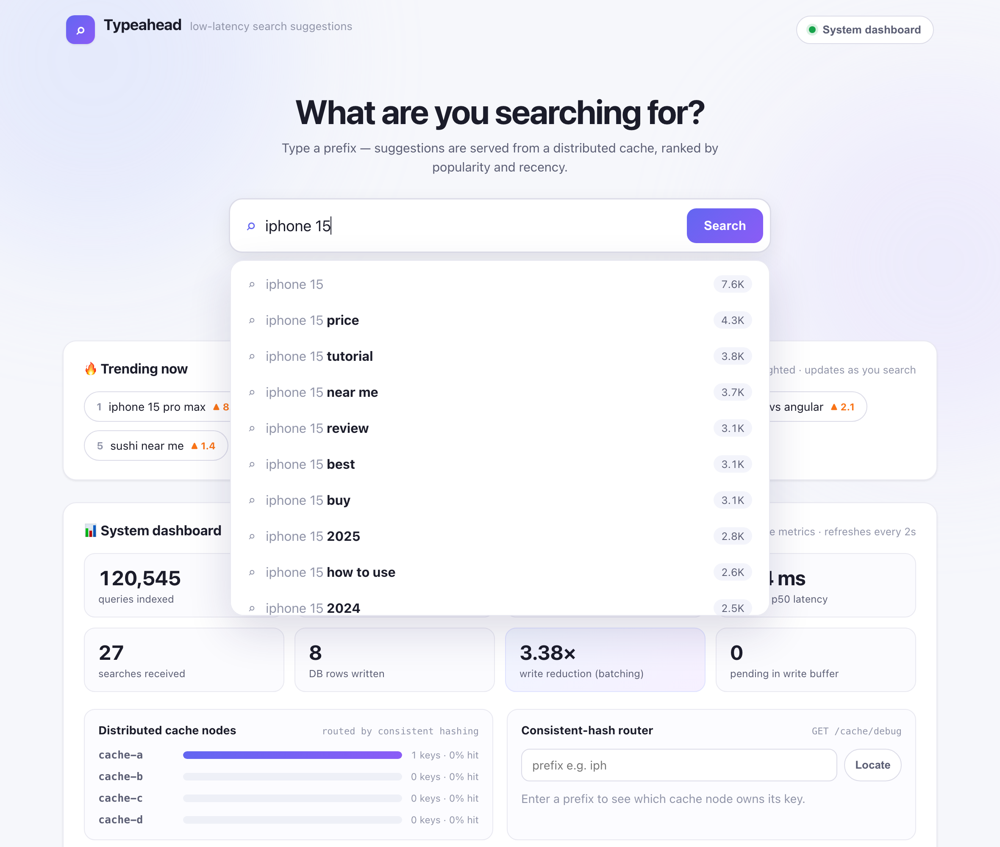
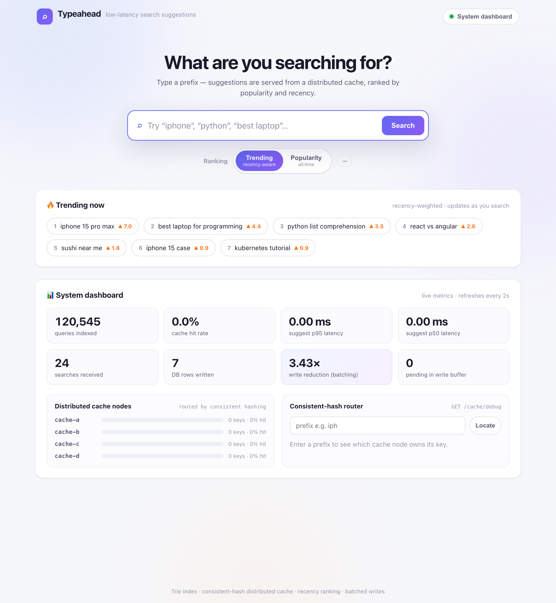

# Search Typeahead

A low-latency search-suggestion system — the autocomplete you see in search
engines and e-commerce sites — built around four data-system ideas the
[assignment](#assignment-mapping) asks for:

- a **Trie index** for O(prefix) suggestion lookups over 120k+ queries,
- a **distributed cache** of suggestion results, sharded across logical nodes by
  **consistent hashing**,
- **recency-aware ranking** for trending searches (time-decayed popularity), and
- a **batch writer** that aggregates search counts and writes them to the
  primary store in bulk, slashing write load.

It ships with a clean web UI (debounced suggestions, keyboard navigation,
trending board, and a live system dashboard) and a synthetic 120k-query dataset.

```
┌──────────────┐   GET /suggest?q=     ┌───────────────────────────────────────┐
│   Web UI     │ ────────────────────▶ │              FastAPI app                │
│ (debounced,  │   POST /search        │                                         │
│  keyboard,   │ ◀──────────────────── │  ┌────────────┐  miss   ┌────────────┐  │
│  trending,   │   {"message":         │  │ Distributed│ ──────▶ │   Trie     │  │
│  dashboard)  │     "Searched"}       │  │   Cache    │ ◀────── │   index    │  │
└──────────────┘                       │  │ (consistent│  fill   │ (top-K per │  │
                                       │  │  hashing)  │         │   node)    │  │
                                       │  └────────────┘         └─────┬──────┘  │
                                       │        ▲   invalidate          │ rebuild │
                                       │        │                       │ on boot │
                                       │  ┌─────┴───────┐   flush  ┌─────▼──────┐  │
                                       │  │ Batch writer│ ───────▶ │  SQLite    │  │
                                       │  │ (aggregate) │  (bulk)  │  primary   │  │
                                       │  └─────────────┘          │  store     │  │
                                       │     ▲ recency tracker     └────────────┘  │
                                       │     │ (time-decay) ──▶ /trending           │
                                       └───────────────────────────────────────────┘
```

See [`docs/ARCHITECTURE.md`](docs/ARCHITECTURE.md) for the full design write-up
and [`docs/API.md`](docs/API.md) for endpoint contracts.

### Screenshots

| Live suggestions | Home + system dashboard |
| --- | --- |
|  |  |

---

## Quick start

```bash
./run.sh
```

`run.sh` creates a virtualenv, installs dependencies, generates the dataset on
first run, and starts the server. Then open <http://127.0.0.1:8000>.

First start takes a few seconds: it loads 120k rows into SQLite and builds the
Trie. Subsequent starts reuse the SQLite DB and only rebuild the in-memory index.

### Manual setup

```bash
python3 -m venv .venv && source .venv/bin/activate
pip install -r requirements.txt
python scripts/generate_dataset.py --rows 120000 --out data/queries.csv   # optional; the server auto-generates if missing
uvicorn app.main:app --reload
```

### Requirements
- Python 3.9+ (no external services — SQLite is built in)

---

## Using it

- **Type** in the search box → up to 10 suggestions appear (debounced 160 ms),
  matched on prefix, ranked by popularity (and recency in trending mode), with
  the completion highlighted and a 🔥 badge on recently-searched queries.
- **Submit** (Enter, the Search button, or click a suggestion) → calls the dummy
  `POST /search`, which returns `{"message": "Searched"}` and records the query.
- **Ranking toggle** → switch between *Trending (recency-aware)* and *Popularity
  (all-time)* to see the difference live.
- **Trending now** → top queries by time-decayed score; updates as you search.
- **System dashboard** → live cache hit rate, p95 latency, queries indexed,
  searches vs DB writes (the batching win), per-node cache load, and a
  consistent-hash router you can probe by prefix.

Keyboard: `↓`/`↑` move through suggestions, `Enter` searches the highlighted one,
`Esc` closes the dropdown.

---

## API

| Endpoint | Purpose |
| --- | --- |
| `GET /suggest?q=<prefix>&recency=<bool>` | Up to 10 prefix suggestions, sorted by count (or recency-blended). |
| `POST /search` `{"query": "..."}` | Dummy search; returns `{"message":"Searched"}` and records the query. |
| `GET /cache/debug?prefix=<prefix>` | Which cache node owns the prefix key + hit/miss/expired + ring position. |
| `GET /trending?k=<n>` | Recency-ranked trending queries. |
| `GET /stats` | Latency p50/p95/p99, cache hit rate, DB writes, write reduction, ring balance. |
| `GET /health` | Liveness probe. |

Full contracts and examples: [`docs/API.md`](docs/API.md).

---

## Performance

Measured locally with `scripts/benchmark.py` (5,000 suggest requests over a
hot-prefix-heavy workload + 3,000 searches):

| Metric | Result |
| --- | --- |
| Suggest latency (server, in-process) | **p95 ≈ 0.006 ms** |
| Suggest latency (client, incl. HTTP) | p50 ≈ 0.39 ms, **p95 ≈ 0.41 ms** |
| Cache hit rate | **~81%** (matches the 80/20 hot/cold workload) |
| Write reduction (batching) | **~6×** (3,045 searches → 495 DB rows) |
| Queries indexed | 120,160 |

Reproduce:

```bash
python scripts/benchmark.py --suggests 5000 --searches 3000
```

Write reduction scales with how skewed/repetitive the search stream is — a
production stream (very Zipfian) coalesces far more aggressively than the test's
synthetic 30% unique tail.

---

## Configuration

Everything is tunable via environment variables (see `app/config.py`). Useful for
demos:

```bash
# Make TTLs and recency visibly short so you can watch caching/decay live:
CACHE_TTL_SECONDS=10 RECENCY_HALF_LIFE_SECONDS=30 BATCH_FLUSH_INTERVAL_SECONDS=1 ./run.sh
```

| Variable | Default | Meaning |
| --- | --- | --- |
| `CACHE_NODES` | `cache-a,cache-b,cache-c,cache-d` | Logical cache shards on the ring. |
| `CACHE_VNODES` | `200` | Virtual nodes per shard (ring balance). |
| `CACHE_TTL_SECONDS` / `CACHE_TTL_RECENCY_SECONDS` | `60` / `15` | Result TTLs. |
| `RECENCY_HALF_LIFE_SECONDS` | `120` | How fast trending decays. |
| `RANK_RECENCY_WEIGHT` | `2.5` | Weight of recency vs all-time popularity. |
| `BATCH_FLUSH_INTERVAL_SECONDS` / `BATCH_MAX_SIZE` | `2.0` / `500` | Flush triggers. |
| `TRIE_NODE_CAP` | `25` | Candidate pool per Trie node (re-rank source). |

---

## Dataset

`scripts/generate_dataset.py` synthesizes **120,160 unique queries** with a
Zipfian (long-tail) count distribution and realistic, prefix-sharing surface
forms (`iphone 15 price`, `python list comprehension`, `best laptop`, …). It is
deterministic (fixed seed) and needs no network.

**Format** (`data/queries.csv`):

```csv
query,count
lg printer,2078127
iphone 11,62736
...
```

To use a real open-source dataset instead (AOL query logs, Wikipedia titles +
view counts, an e-commerce catalog, …), just drop a CSV with `query,count`
columns at `data/queries.csv` and restart — the loader reads any such file.

---

## Project layout

```
app/
  config.py            # all tunables (env-overridable)
  store.py             # SQLite primary store (durable source of truth)
  trie.py              # prefix Trie with per-node cached top-K
  consistent_hash.py   # hash ring with virtual nodes (MD5)
  distributed_cache.py # logical LRU+TTL cache nodes routed by the ring
  ranking.py           # time-decay recency tracker + blended scoring
  batch_writer.py      # buffer/aggregate/flush background writer
  metrics.py           # latency percentiles + counters
  service.py           # orchestrates all of the above (request flows)
  main.py              # FastAPI app, routes, startup ingestion
static/                # web UI (index.html, styles.css, app.js)
scripts/
  generate_dataset.py  # dataset generator
  benchmark.py         # performance benchmark
docs/                  # ARCHITECTURE.md, API.md
tests/                 # unit tests for the core data structures
```

---

## Tests

```bash
python -m unittest discover -s tests -v
```

Covers consistent-hash balance & remap stability, the Trie's top-K ordering,
cache TTL/LRU/invalidation, recency decay, and batch aggregation.

---

## Assignment mapping

| Requirement | Where |
| --- | --- |
| 10 prefix suggestions, sorted by count | `trie.py`, `service.suggest`, `GET /suggest` |
| Search UI + suggestion dropdown + trending + states | `static/` |
| Dummy `POST /search` → `{"message":"Searched"}` + records | `service.search`, `main.py` |
| Storage + caching design | `store.py`, `distributed_cache.py`, `docs/ARCHITECTURE.md` |
| Distributed cache via **consistent hashing** | `consistent_hash.py`, `distributed_cache.py`, `GET /cache/debug` |
| Trending searches (recency) | `ranking.py`, `GET /trending`, recency mode |
| Batch writes | `batch_writer.py` |
| Latency / hit-rate / write-reduction reporting | `metrics.py`, `GET /stats`, `scripts/benchmark.py` |
| ≥100k dataset | `scripts/generate_dataset.py` (120,160) |

See [`docs/ARCHITECTURE.md`](docs/ARCHITECTURE.md) for the design rationale and
trade-offs behind each of these.
